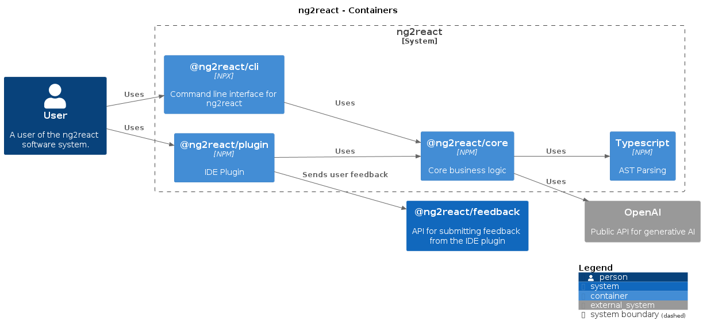
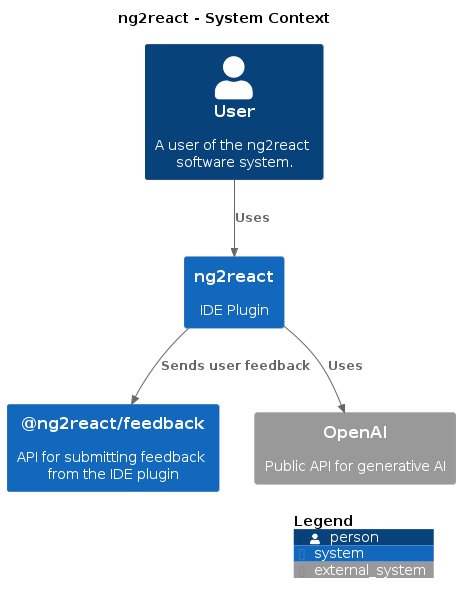

# ng2react Documentation

ng2react is a tool that converts AngularJS components to React components using the OpenAI API. It consists of an IDE plugin, a core library, a CLI, and a feedback API.

## IDE Plugin

The ng2react IDE plugin is an essential component of the ng2react software system. It integrates with the user's development environment and provides an interface for converting AngularJS components to React components using the core library. The plugin also enables users to submit feedback about the conversion results directly to the feedback API.

### Features

- **Convert AngularJS Components**: The plugin allows users to easily convert AngularJS components to React components by sending the components to the ng2react core library, which uses TypeScript for parsing AngularJS components and the OpenAI API to generate the React version of the component.

- **Feedback Submission**: The plugin enables users to submit feedback about the conversion results directly from the IDE. This feedback helps the ng2react team to identify areas for improvement and ensure the tool continues to meet user needs.

- **User-friendly Interface**: The ng2react IDE plugin is designed with usability in mind, providing a seamless experience for developers working with both AngularJS and React codebases.

### Architecture Diagram

## Core Library

The ng2react core library is responsible for converting AngularJS components to React components. It leverages the TypeScript AST for parsing AngularJS components and uses the OpenAI API to generate the corresponding React components.

### Architecture Diagram

## CLI

The ng2react CLI is a command-line interface that enables developers to convert AngularJS components to React components without using an IDE plugin. It provides a convenient way for developers to integrate the ng2react functionality into their existing workflows and tooling.

## Feedback API

The feedback API allows users to submit feedback about the conversion results directly from the ng2react IDE plugin. It stores the feedback data in a database for later analysis and review by the ng2react team. This feedback is essential for identifying areas for improvement and ensuring the tool continues to meet user needs.

### Architecture Diagram

TBD

## Feedback Analysis Client

The feedback analysis client is a tool used by the ng2react team to review and analyze the feedback submitted by users. It provides an interface for browsing, filtering, and analyzing feedback data stored in the feedback database. This tool helps the team identify trends, common issues, and areas for improvement in the ng2react system.

